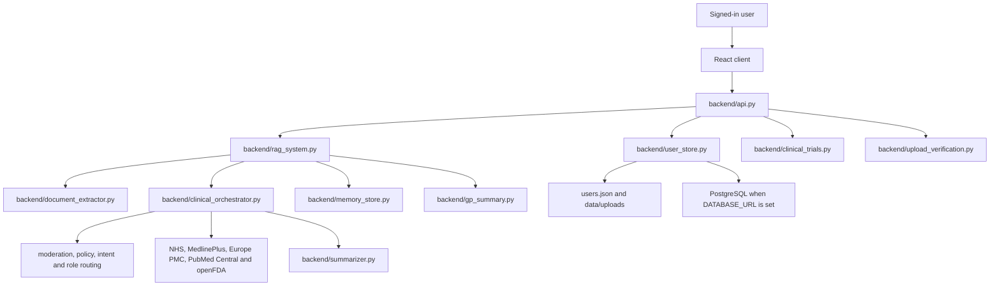

# Dr. Charlotte

Dr. Charlotte is a mobile-first React app backed by a FastAPI API. It gives signed-in users one workspace for health questions, uploaded records, symptom and measurement tracking, medicine lists, GP-ready summaries, evidence review and clinical-trial search.

The Python backend keeps the clinical workflow, retrieval, extraction, persistence and export services. The React client lives in `frontend/` and calls `/api/*` endpoints exposed by `backend/api.py`.

## Screenshots and Flow


## Quick Start

From the repository root in PowerShell:

```powershell
py -3.12 -m venv .venv
.\.venv\Scripts\Activate.ps1
py -3.12 -m pip install --upgrade pip
py -3.12 -m pip install -r requirements.txt
```

Create a `.env` file with your settings:

```env
OPENAI_API_KEY=your_openai_api_key_here
OPENAI_BASE_URL=https://api.openai.com/v1
OPENAI_MODEL=gpt-4o-mini
OPENAI_EMBEDDING_MODEL=text-embedding-3-small
DATABASE_URL=
```

Install and build the frontend:

```powershell
cd frontend
npm install
npm run build
cd ..
```

Start the app:

```powershell
py -m uvicorn backend.api:app --host 127.0.0.1 --port 8000
```

Open `http://127.0.0.1:8000`.

For frontend-only development, keep the backend running on port `8000`, then run this in `frontend/`:

```powershell
npm run dev
```

Vite proxies `/api` to `http://127.0.0.1:8000`.

## Main Runtime Flows

### Account and Consent

The React client handles sign-in, account creation, role selection, profile details, date of birth, biological sex, role terms and privacy acceptance. `backend/user_store.py` validates and stores the account, hashes passwords with PBKDF2, and normalises old user records when new fields are added.

### Document Uploads

Uploaded PDFs are saved under `data/uploads/<username>/`. The backend checks the filename and extracted PDF text for patient-name candidates before processing. If the name is missing, unclear or mismatched, the API returns a verification state so the user can decide whether to continue.

After verification, the document text is extracted, anonymised where possible, summarised and added to the user's retrieval context. `backend/document_extractor.py` extracts structured health data and `backend/user_store.py` saves it into the correct collections.

### Chat Answers

`backend/rag_system.RAGEngine` restores saved documents, symptoms, medicines, allergies, conditions, vitals and longitudinal memory for the signed-in user. The clinical orchestrator applies role routing, crisis checks, moderation, policy gates and pathway logic before retrieval. Retrieved evidence is ranked and the model writes a cited, role-aware answer with a structured triage summary.

### Clinical Trial Search

`backend/clinical_trials.py` builds a trial-search profile from saved health context, searches ClinicalTrials.gov, merges results by NCT ID, applies deterministic scoring and asks the model for clinical-alignment scoring. The ranked result is saved so it can be restored after a restart.

### Timeline and GP Summary

The API exposes saved symptoms, measurements, medicines, allergies, conditions, uploads and triage summaries for the React timeline. `backend/gp_summary.py` creates a concise PDF handover from the user's saved profile, documents, trackers, memory and recent triage summaries.

## What It Can Do

- Create an account, sign back in and keep a saved workspace.
- Store chat history, uploaded records, health trackers, audit events and clinical trial results per user.
- Upload PDFs such as blood results, discharge summaries, clinic letters and medical records.
- Check whether the patient name found in an uploaded document matches the full name saved on the account.
- Extract health information from uploaded documents, including measurements, allergies, medicines, conditions, height, weight, blood pressure and lab values where present.
- Log symptoms over time with dates, severity, triggers and notes.
- Keep a medication list and check openFDA label sections for possible interaction warnings.
- Build a health timeline across symptoms, measurements, triage summaries, medicines and records.
- Search live evidence from NHS guidance, MedlinePlus, Europe PMC, PubMed Central and openFDA.
- Generate structured triage summaries with urgency, next steps and monitoring points.
- Export a short GP handover PDF using the account's saved data.
- Search ClinicalTrials.gov for recruiting trials that fit the user's saved health profile.
- Accept voice input through Whisper transcription when the browser supports recording.
- Generate clinical-style educational images and short demonstration videos when explicitly requested.

## Architecture



## Project Structure

```text
backend/
  api.py                     FastAPI app and React static-file serving
  anonymizer.py              document redaction helpers
  clinical_orchestrator.py   main clinical workflow engine
  clinical_trials.py         ClinicalTrials.gov search and scoring
  context_graph.py           health context graph helpers
  document_extractor.py      structured extraction from uploaded documents
  evidence_ranker.py         source ranking and evidence tiers
  gp_summary.py              GP handover PDF generation
  image_generator.py         image generation integration
  medication_checker.py      openFDA interaction checks
  memory_store.py            longitudinal memory refresh
  official_guidance.py       NHS and MedlinePlus retrieval
  patient_history.py         account health context builder
  policy_engine.py           safety policy checks
  pubmed_search.py           Europe PMC and PubMed Central retrieval
  rag_system.py              retrieval, generation and ingestion engine
  role_router.py             role-aware routing
  summarizer.py              document summarisation
  symptom_tracker.py         symptom helpers
  triage_summary.py          structured triage cards
  upload_verification.py     upload name checks and verification helpers
  user_store.py              accounts, profiles and persistence
  video_generator.py         video generation integration
  voice_transcriber.py       Whisper transcription

frontend/
  index.html                 Vite entry HTML
  package.json               frontend scripts and dependencies
  src/                       React app, API client, styles and types
  public/                    static frontend assets

requirements.txt             Python dependencies
Procfile                     hosted FastAPI start command
```

## Tech Stack

- Frontend: React, TypeScript and Vite
- API: FastAPI and Uvicorn
- Answer generation, extraction and trial scoring: OpenAI Chat Completions
- Embeddings: OpenAI `text-embedding-3-small`
- Voice transcription: OpenAI Whisper
- Image generation: OpenAI `gpt-image-1`
- Video generation: OpenAI `sora-2`
- Official guidance retrieval: NHS and MedlinePlus
- Biomedical literature retrieval: Europe PMC and PubMed Central
- Medicine interaction support: openFDA drug label API
- Clinical trial search: ClinicalTrials.gov API v2
- PDF parsing and GP summary export: PyMuPDF
- Persistence: local JSON or PostgreSQL
- Moderation: rule-based checks with Detoxify support when available

## PostgreSQL and Hosted Use

For local development, `users.json` is usually enough. For hosted or shared use, configure PostgreSQL so data does not disappear between deployments.

1. Create a Neon database or another PostgreSQL database.
2. Add `DATABASE_URL` to the environment.
3. Restart the app.

## Troubleshooting

### `OPENAI_API_KEY not found in environment variables`

Create `.env`, add a real key and start FastAPI from the project root.

### Accounts or trial results disappear on a hosted deployment

Set `DATABASE_URL` so the app uses PostgreSQL instead of the local `users.json` file.

### A PDF says the name cannot be found

Make sure the full name saved on the account is the patient's real full name. The app checks the document text and filename. If the document is correct but the name cannot be detected, verify it before extraction.

### Auto-populated data from a PDF looks wrong

Review the entries in the trackers and remove anything incorrect. The extractor reads free-text documents and may misread a value, date or unit.

### Clinical trial search returns no results

The trial finder needs saved health context such as conditions, symptoms, medicines or uploaded documents. Also check that the host can make outbound HTTPS requests to ClinicalTrials.gov.

### Voice input is unavailable

Make sure the browser allows microphone access and that the backend has a valid OpenAI API key for transcription.

### Medication warnings do not appear

The interaction checker uses public openFDA label sections. If a medicine name cannot be resolved, or if the label does not mention the paired medicine, the app may not show a pair-specific warning. A pharmacist or clinician should still review any medicine concern.

## Important Note

Dr. Charlotte is for health education, evidence review and decision support. It is not a substitute for emergency care, diagnosis or a clinician's judgement.

If someone may be seriously unwell, use the right urgent care route, such as NHS 111 or 999 in the UK.
