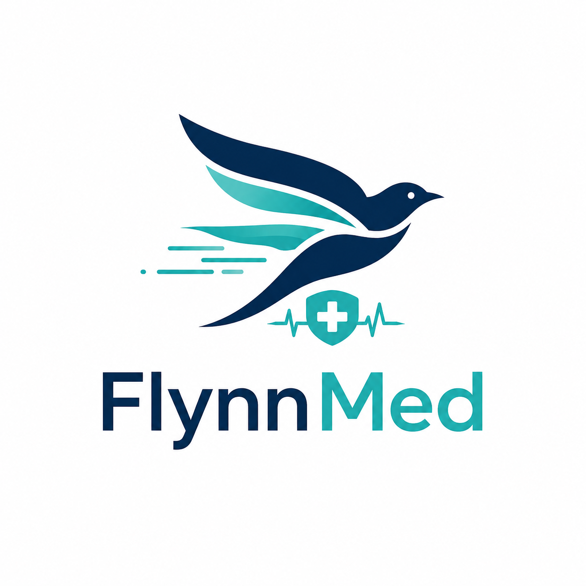
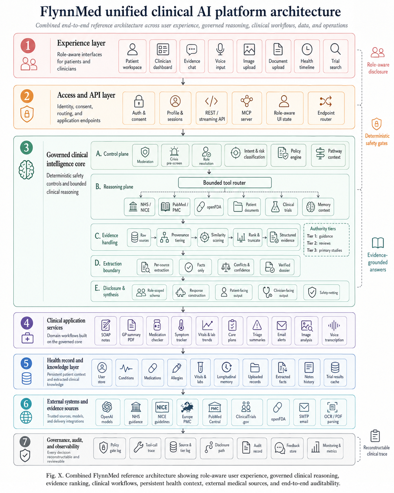
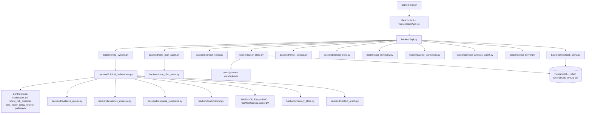

<p align="center">
  
</p>

# FlynnMed

FlynnMed is a clinical AI platform for patients and healthcare professionals. It gives signed-in users a role-aware workspace for evidence-based health questions, medical image triage, document upload, symptom and measurement tracking, medication management, agentic care-plan generation, SOAP clinical notes, GP-ready summaries, clinical trial search and secure email delivery -- with every answer passed through deterministic safety gates and evidence-tier ranking before it reaches the user.

The Python backend (`backend/`) runs the full clinical workflow: crisis pre-screen, intent and risk classification, role routing, tiered evidence retrieval, hard policy gates, note generation, care-plan generation and email. The React/TypeScript frontend (`frontend/`) is a single-page app that talks to `/api/*` endpoints served by `backend/api.py`. Both are built and deployed as one ASGI service -- there is no separate frontend host.

This README is written for developers working on the codebase: it documents the system architecture, every backend module, the full REST API surface, environment configuration and deployment. If you're looking for end-user documentation, see the [Features](#features) section below instead.

<p align="center">
  
  
  
  
  <br />
  <a href="LICENSE"></a>
  
  <a href="https://github.com/Franosei/my_health_chatbot/stargazers"></a>
</p>

---

## Table of Contents

- [Architecture](#architecture)
- [Quick Start](#quick-start)
- [User Roles](#user-roles)
- [Features](#features)
- [Project Structure](#project-structure)
- [API Reference](#api-reference)
- [Model Context Protocol (MCP) Server](#model-context-protocol-mcp-server)
- [Tech Stack](#tech-stack)
- [Environment Variables](#environment-variables)
- [Testing](#testing)
- [Deployment](#deployment)
- [PostgreSQL](#postgresql)
- [Troubleshooting](#troubleshooting)
- [License](#license)
- [Important Note](#important-note)

---

## Architecture

FlynnMed is organised as seven layers, from the role-aware UI down to governance and audit. The reference diagram below is the source of truth for how a request moves through the system; the sections that follow map each box to the actual module that implements it.



### 1. Experience layer
Role-aware React SPA (`frontend/src/App.tsx`) rendering the patient workspace, clinician dashboard, evidence chat, voice input, image upload, document upload, health timeline and trial search -- all from one component tree, gated on the signed-in user's `role`.

### 2. Access and API layer
`backend/api.py` is the single FastAPI application. It owns:
- **Auth & consent** -- JWT issuance/verification (HMAC-signed, `_token_secret()`), bcrypt password hashing, signup consent gate
- **Profile & sessions** -- `/api/me`, `/api/snapshot`, `/api/profile`
- **REST / streaming API** -- all `/api/*` endpoints, including Server-Sent Events streaming for chat (`/api/chat/stream`, `/api/chat/image/stream`)
- **MCP server** -- `backend/mcp_server.py` mounted at `/mcp` on the same process
- **Role-aware UI state** -- `backend/role_router.py` and `backend/product_config.py` resolve profile role strings into `RoleConfig` bundles the frontend renders against
- **Endpoint router** -- FastAPI also serves the built `frontend/dist` as static files, so one process handles both the API and the SPA

### 3. Governed clinical intelligence core
`backend/clinical_orchestrator.py` (`ClinicalOrchestrator`) is the central workflow engine every chat message passes through, in five stages:

| Stage | Responsibility | Key modules |
|---|---|---|
| A. Control plane | Moderation, crisis pre-screen, role resolution, intent & risk classification, policy gate evaluation, pathway selection | `moderation_ml.py`, `intent_risk_classifier.py`, `role_router.py`, `policy_engine.py`, `pathways/` |
| B. Reasoning plane | Bounded tool router -- an LLM tool-calling loop that decides which evidence sources to query before any answer is drafted | `clinical_orchestrator.py`, `official_guidance.py`, `pubmed_search.py`, `medication_checker.py`, `clinical_trials.py`, `memory_store.py` |
| C. Evidence handling | Provenance tracking, tiering, similarity scoring, rank & truncate into structured evidence | `evidence_ranker.py`, `evidence_schema.py` |
| D. Extraction boundary | Per-source, facts-only extraction with conflict detection and confidence scoring -- this is the anti-hallucination layer between raw sources and the LLM | `evidence_extractor.py` |
| E. Disclosure & synthesis | Role-scoped response schema, patient-facing vs clinician-facing construction, safety-netting text | `response_templates.py`, `summarizer.py` |

Authority tiers applied in stage C: **Tier 1** -- NHS guidance and NICE guidelines · **Tier 2** -- systematic reviews and Cochrane-style evidence · **Tier 3** -- primary research from Europe PMC / PubMed Central.

### 4. Clinical application services
Domain workflows built on top of the governed core: `clinical_notes.py` (SOAP notes), `gp_summary.py` (GP handover PDF export), `medication_checker.py` (openFDA interaction checks), `symptom_tracker.py` (trend summaries), `care_plan_agent.py` + `care_plan_store.py` (agentic care-plan generation), `triage_summary.py` (structured triage output), `email_service.py` (note and alert delivery), `image_analysis_agent.py` (medical image intake), `voice_transcriber.py` (Whisper transcription).

### 5. Health record and knowledge layer
Persistent patient context, all owned by `user_store.py` (`UserStore`): profile, conditions, medications, allergies, vitals/labs, uploaded records (`document_extractor.py` extracts structured facts on ingest), clinical notes history, cached trial results, and longitudinal memory (`memory_store.py`, refreshed incrementally as the account grows). `context_graph.py` builds a fast, no-LLM relevance graph over this record so retrieval can pull only what's relevant to the current question, and `patient_history.py` structures it into a compact context block for prompts.

### 6. External systems and evidence sources
OpenAI (chat, embeddings, vision, Whisper, image/video generation), NHS Conditions and NICE guidance, Europe PMC and PubMed Central, openFDA drug labels, ClinicalTrials.gov, SMTP (Gmail or any provider) for email, PyMuPDF for PDF parsing and export.

### 7. Governance, audit, and observability
Every gate decision, tool call and evidence tier is reconstructable: `policy_engine.py` logs each of its eight hard gates, `audit_models.py` defines `ClinicalAuditTrace` and `PolicyGateRecord`, and `feedback_store.py` persists anonymised thumbs-up/down quality signals (intent, risk level, role, pathway, evidence tiers, policy gates, alignment flags -- never question or answer text) to PostgreSQL for offline review.

### Component diagram



---

## Quick Start

### 1. Python environment

```powershell
py -3.12 -m venv .venv
.\.venv\Scripts\Activate.ps1
py -3.12 -m pip install --upgrade pip
py -3.12 -m pip install -r requirements.txt
```

### 2. Environment variables

Create a `.env` file in the project root:

```env
# OpenAI
OPENAI_API_KEY=your_openai_api_key
OPENAI_BASE_URL=https://api.openai.com/v1
OPENAI_MODEL=gpt-4o-mini
OPENAI_VISION_MODEL=gpt-4o
OPENAI_EMBEDDING_MODEL=text-embedding-3-small

# Email (Gmail SMTP)
SMTP_HOST=smtp.gmail.com
SMTP_PORT=587
SMTP_USER=your@gmail.com
SMTP_PASSWORD=your-16-char-app-password
EMAIL_FROM=FlynnMed <your@gmail.com>

# Database (optional -- defaults to local users.json)
DATABASE_URL=

# MCP API key (optional -- protects /mcp endpoint)
MCP_API_KEY=
```

Gmail requires an App Password, not your regular password. Generate one at:
`myaccount.google.com -> Security -> 2-Step Verification -> App passwords`

### 3. Frontend

```powershell
cd frontend
npm install
npm run build
cd ..
```

### 4. Start the server

```powershell
py -m uvicorn backend.api:app --host 127.0.0.1 --port 8000
```

Open `http://127.0.0.1:8000`.

### 5. Frontend development

Keep the backend running on port 8000, then in `frontend/`:

```powershell
npm run dev
```

Vite proxies `/api` to `http://127.0.0.1:8000`.

---

## User Roles

FlynnMed adapts its interface and responses to the signed-in user's role.

| Role | What they see |
|---|---|
| Patient | Clean response text, no clinical metadata, simplified SOAP note view, urgent care strip only when action is needed |
| Doctor | Full SOAP notes (Subjective / Objective / Assessment / Plan), sources, evidence basis, triage card, editable notes |
| Nurse | Role-adapted notes (Presenting concern / Observations / Nursing assessment / Care plan), editable |
| Midwife | Maternal-focused notes (Maternal concern / Maternal and fetal assessment / Risk assessment / Maternity plan), editable |
| Physiotherapist | MSK-focused notes (Presenting complaint / Physical assessment / Clinical impression / Treatment plan), editable |

Patients never see raw clinical metadata, source lists, evidence tiers, trace IDs or SOAP edit controls. Clinicians receive the full clinical picture. Role labels and per-role terms live in `backend/product_config.py`; the mapping from a stored profile role to UI/prompt behaviour lives in `backend/role_router.py`.

---

## Features

### Account and Access
- Role-aware sign-up with consent gate (GDPR-compliant)
- Role terms shown per clinical role at sign-up
- Password hashed with bcrypt; minimum 8 characters enforced
- Persistent session via JWT stored in localStorage
- Profile editing: display name, email, date of birth, biological sex, care context, organisation

### Evidence Chat
- Streaming evidence-based responses via GPT-4o-mini
- Role-aware clinical workflow: crisis pre-screen, intent classification, risk stratification, tiered evidence retrieval, policy gates and pathway logic applied before every answer
- Medical image analysis for JPG, PNG and WebP uploads: non-medical images are rejected, visual findings are screened first, then the agentic evidence pipeline searches guidance and research before answering
- Follow-up chips after each response: short first-person statements generated from the evidence that the user can tap to refine the answer
- Voice input via OpenAI Whisper (browser microphone permission required)
- Enter to send; Shift+Enter for a new line
- Patient view: clean response text with subtle urgency strip only for high, urgent or crisis levels
- Clinician view: collapsible triage card, source list and evidence basis chips after response text

### Evidence Tiers
Evidence is retrieved and ranked across three tiers:
- Tier 1: NHS guidance and NICE guidelines
- Tier 2: Systematic reviews and Cochrane-style evidence
- Tier 3: Primary research papers from Europe PMC and PubMed Central

### Care Plans
- Agentic, tool-calling care-plan generation (`backend/care_plan_agent.py`) that pulls NHS/NICE guidance and PubMed evidence for a named condition before synthesising a structured plan
- Plans include goals, medication reminders, lab reminders, escalation thresholds and a missed-care checklist
- Task-level tracking: mark individual care-plan tasks complete via `PATCH /api/care-plans/{plan_id}/tasks/{task_id}`
- After-visit summary generation and GP-appointment prep notes generated from the saved plan
- Plans persisted per user in `backend/care_plan_store.py`

### SOAP Clinical Notes
- Generate a SOAP note from the current conversation at any time
- Role-specific section labels and LLM prompt guidance per clinical role
- Backend formats all fields as clean markdown -- no raw Python dicts or lists
- Clinicians can edit all four sections inline and save changes
- Patients see a simplified read-only view: "What was discussed" and "What happens next"
- Notes stored per user and restored on next login
- Email a note directly to the user's registered email address
- Send a GP alert email for notes flagged as requiring a GP visit

### Health Record
- Symptom log with dates, severity, triggers and notes, plus trend summarisation (`backend/symptom_tracker.py`)
- Medication list with dose, schedule and openFDA interaction checks
- Allergy and adverse drug reaction list
- Conditions list (active and past)
- Vitals and lab readings: blood pressure, heart rate, weight, blood glucose, oxygen saturation, temperature, HbA1c, eGFR and more
- All record sections editable from the chat side panel

### Document Uploads
- PDF upload with anonymisation and patient-name verification before extraction
- Structured extraction of measurements, allergies, medications, conditions, heights, weights and lab values from uploaded documents
- Extracted data added to the user's retrieval context automatically

### Health Timeline
- Scrollable timeline of conditions, medications, allergies, readings, triage summaries and uploaded records
- Trend cards for chartable vital types when at least two readings are saved

### GP Summary Export
- One-click PDF export of the user's saved health record, documents, longitudinal memory and recent triage summaries ready for a GP or hospital appointment

### Clinical Trial Search
- Searches ClinicalTrials.gov for recruiting trials matched to the user's saved conditions, medications and symptom logs
- Deterministic scoring plus model-based clinical alignment scoring
- Ranked results show trial title, phase, location, contact and link to the official record
- Results saved and restored on next login

### Email Delivery
- SOAP notes emailed as formatted HTML to the user's registered address
- Urgent care alert emails for high, urgent or crisis cases
- Sent via Gmail SMTP (or any SMTP provider) using App Password authentication
- Clear error messages if SMTP is not configured

### Feedback and Quality Signals
- Thumbs-up / thumbs-down rating on any assistant response (`POST /api/feedback`)
- Stores only anonymised quality metadata -- intent category, risk level, user role, pathway used, evidence tiers, source count, policy gates and alignment flags
- Never stores question text, answer text, username or email address
- Persisted to PostgreSQL via `backend/feedback_store.py` for offline model and prompt quality review

### Model Context Protocol (MCP) Server
- Mounted at `/mcp` on the same server process -- no separate service needed
- Works in Railway deployments (streamable HTTP) and locally (stdio)
- Optional API key guard via `MCP_API_KEY` environment variable
- Exposes five tools to AI agents and Claude Desktop -- see [Model Context Protocol (MCP) Server](#model-context-protocol-mcp-server) below

### Safety and Moderation
- Crisis pre-screen on every message before the main pipeline
- Eight hard policy gates: crisis, pregnancy, paediatric, medication, diagnosis, elderly, mental health, urgent
- Role-adaptive moderation using Detoxify (RoBERTa) and regex rules
- Escalation triggers and safety-netting included in every clinical answer

---

## Project Structure

```text
backend/
  api.py                        FastAPI app: all /api/* endpoints, auth, static file serving, MCP mount
  anonymizer.py                 document redaction helpers
  audit_models.py               ClinicalAuditTrace and PolicyGateRecord dataclasses
  care_plan_agent.py            agentic, tool-calling care-plan generator (NHS/NICE + PubMed)
  care_plan_store.py            per-user care-plan persistence
  clinical_decision_support.py  ClinicalDecision objects with evidence-based triage guidance
  clinical_notes.py             SOAP note generation, role-specific prompts and coercion
  clinical_orchestrator.py      central clinical workflow engine (control/reasoning/evidence/disclosure)
  clinical_trials.py            ClinicalTrials.gov search and scoring
  context_graph.py              fast, no-LLM relevance graph over a user's prior health records
  document_extractor.py         structured extraction from uploaded PDFs
  email_service.py              SMTP sender for notes, verification codes and urgent alerts
  evidence_extractor.py         anti-hallucination, per-source article evidence extraction
  evidence_ranker.py            three-tier source ranking
  evidence_schema.py            Pydantic schema for extracted evidence dossiers
  feedback_store.py             anonymised response-quality signal store (Neon PostgreSQL)
  gp_summary.py                 GP handover PDF generation
  image_analysis_agent.py       medical image intake validation and analysis
  image_generator.py            GPT image generation integration
  intent_risk_classifier.py     intent and risk level classification (regex pre-screen + LLM)
  mcp_server.py                 Model Context Protocol server
  medication_checker.py         openFDA interaction checks
  memory_store.py                longitudinal memory refresh
  moderation_ml.py              role-adaptive Detoxify and regex moderation
  official_guidance.py          NHS and MedlinePlus retrieval
  patient_history.py            structures a patient's known history into a compact prompt context
  pathways/                     five specialty clinical pathways
    general_triage.py
    maternity.py
    msk.py
    medications.py
    chronic_conditions.py
  policy_engine.py              eight hard safety gates
  product_config.py             PRODUCT_NAME, role options, role terms, privacy notice text
  pubmed_search.py              Europe PMC and PubMed Central retrieval
  query_expander.py             query expansion for retrieval
  rag_system.py                 retrieval, generation and document ingestion engine
  response_templates.py         role-specific headings, personas and tier labels
  role_router.py                RoleConfig and RoleRouter per clinical role
  summarizer.py                 LLM wrapper, follow-up chips and SOAP generation helpers
  symptom_tracker.py            symptom trend summarisation
  triage_summary.py             structured triage output
  upload_verification.py        upload name checks and verification helpers
  user_store.py                 accounts, profiles, chat history, notes and persistence
  video_generator.py            medical video generation (Sora-2)
  voice_transcriber.py          voice transcription (Whisper)
  test_*.py                     unit tests (pytest) for the modules above

frontend/
  index.html                    Vite entry HTML
  package.json                  scripts and dependencies
  src/
    App.tsx                     full React app: all views, components and chat logic
    api.ts                      typed API client for all backend endpoints
    styles.css                  design system and component styles
    types.ts                    TypeScript types for all shared data shapes
    utils.ts                    formatting and helper functions
  public/                       static assets

agents/
  commands/                     Claude Code skills

image/
  identity.png                  FlynnMed logo
  architecture.png              reference architecture diagram (embedded above)

Dockerfile                      container build
Procfile                        Railway/Heroku start command
requirements.txt                Python dependencies
```

---

## API Reference

All endpoints are served from `backend/api.py` and prefixed `/api` unless noted. Auth endpoints issue an HMAC-signed JWT that must be sent as `Authorization: Bearer <token>` on every other call.

| Method | Path | Purpose |
|---|---|---|
| GET | `/api/health` | Liveness check |
| GET | `/api/config` | Public product config (name, role options) |
| POST | `/api/auth/signup` | Create an account (role, consent, password) |
| POST | `/api/auth/login` | Exchange credentials for a JWT |
| GET | `/api/me` | Current user profile |
| GET | `/api/snapshot` | Full workspace snapshot (record, notes, trials, memory) on load |
| PUT | `/api/profile` | Update profile fields |
| GET | `/api/terms/{role_label}` | Role-specific terms text shown at signup |
| DELETE | `/api/chat` | Clear chat history |
| POST | `/api/chat/stream` | Stream an evidence-based chat response (SSE) |
| POST | `/api/chat/image/stream` | Stream a response to a medical image upload (SSE) |
| POST | `/api/feedback` | Submit thumbs-up/down quality feedback on a response |
| POST | `/api/uploads` | Upload and process a clinical PDF |
| POST | `/api/voice/transcribe` | Transcribe voice input (Whisper) |
| POST | `/api/symptoms` | Add a symptom log entry |
| DELETE | `/api/symptoms/{log_id}` | Remove a symptom log entry |
| POST | `/api/conditions` | Add a condition |
| DELETE | `/api/conditions/{condition_id}` | Remove a condition |
| POST | `/api/medications` | Add a medication |
| DELETE | `/api/medications/{medication_id}` | Remove a medication |
| POST | `/api/allergies` | Add an allergy |
| DELETE | `/api/allergies/{allergy_id}` | Remove an allergy |
| POST | `/api/vitals` | Add a vitals/lab reading |
| DELETE | `/api/vitals/{vitals_id}` | Remove a vitals/lab reading |
| GET | `/api/care-plans` | List saved care plans |
| POST | `/api/care-plans/generate` | Generate a new agentic care plan for a condition |
| GET | `/api/care-plans/{plan_id}` | Get a single care plan |
| DELETE | `/api/care-plans/{plan_id}` | Delete a care plan |
| PATCH | `/api/care-plans/{plan_id}/tasks/{task_id}` | Toggle a care-plan task's completion state |
| POST | `/api/care-plans/{plan_id}/after-visit` | Generate an after-visit summary from a care plan |
| POST | `/api/care-plans/{plan_id}/gp-prep` | Generate GP-appointment prep notes from a care plan |
| GET | `/api/notes` | List saved SOAP notes |
| POST | `/api/notes` | Generate a SOAP note from the current conversation |
| GET | `/api/notes/{note_id}` | Get a single SOAP note |
| PUT | `/api/notes/{note_id}` | Edit a SOAP note (clinician roles) |
| DELETE | `/api/notes/{note_id}` | Delete a SOAP note |
| POST | `/api/notes/{note_id}/email` | Email a SOAP note to the user |
| POST | `/api/email/urgent` | Send an urgent care alert email |
| GET | `/api/export/account` | Export raw account data (JSON) |
| GET | `/api/export/summary.pdf` | Export a GP-ready health summary PDF |
| POST | `/api/trials/search` | Search ClinicalTrials.gov for matching trials |
| GET | `/api/trials/result` | Get the last saved trial search result |

---

## Model Context Protocol (MCP) Server

`backend/mcp_server.py` mounts at `/mcp` on the same server process -- no separate service needed. It works in Railway deployments (streamable HTTP) and locally (stdio), and is guarded by the optional `MCP_API_KEY` environment variable. It exposes five tools to AI agents and Claude Desktop:

| Tool | Description |
|---|---|
| `get_patient_context` | Full patient profile, conditions, medications, vitals and memory |
| `extract_article_evidence` | Structured evidence extraction from a medical article matched to a patient |
| `generate_clinical_note` | Generate and save a SOAP note from a consultation summary |
| `send_health_email` | Send a clinical note or urgent alert by email |
| `search_trials_for_patient` | Search ClinicalTrials.gov for a patient's conditions |

### Claude Desktop (deployed on Railway)

Add to `claude_desktop_config.json`:

```json
{
  "mcpServers": {
    "flynnmed": {
      "url": "https://your-app.railway.app/mcp",
      "headers": {
        "Authorization": "Bearer YOUR_MCP_API_KEY"
      }
    }
  }
}
```

### Claude Desktop (local stdio)

```json
{
  "mcpServers": {
    "flynnmed": {
      "command": "python",
      "args": ["-m", "backend.mcp_server"],
      "cwd": "/path/to/my_health_chatbot"
    }
  }
}
```

Install the `mcp` package first: `pip install mcp`.

---

## Tech Stack

| Layer | Technology |
|---|---|
| Frontend | React 18, TypeScript, Vite |
| API | FastAPI, Uvicorn |
| LLM | OpenAI Chat Completions (gpt-4o-mini) |
| Embeddings | OpenAI text-embedding-3-small |
| Voice | OpenAI Whisper |
| Image analysis | OpenAI vision-capable chat model, then agentic evidence retrieval |
| Image generation | OpenAI gpt-image-1 |
| Video generation | OpenAI sora-2 |
| Biomedical literature | Europe PMC and PubMed Central |
| Official guidance | NHS Conditions and MedlinePlus |
| Drug interactions | openFDA drug label API |
| Clinical trials | ClinicalTrials.gov API v2 |
| Moderation | Detoxify (RoBERTa) with regex fallback |
| PDF parsing and export | PyMuPDF |
| Email | Gmail SMTP via App Password (or any SMTP provider) |
| MCP | FastMCP streamable HTTP |
| Persistence | Local JSON or PostgreSQL |
| Deployment | Railway, Docker or any ASGI host |

---

## Environment Variables

| Variable | Required | Description |
|---|---|---|
| `OPENAI_API_KEY` | Yes | OpenAI API key |
| `OPENAI_BASE_URL` | Yes | OpenAI base URL |
| `OPENAI_MODEL` | Yes | Chat model name |
| `OPENAI_VISION_MODEL` | No | Vision-capable model for medical image intake (default: OPENAI_MODEL or gpt-4o) |
| `OPENAI_EMBEDDING_MODEL` | No | Embedding model (default: text-embedding-3-small) |
| `DATABASE_URL` | No | PostgreSQL connection string; uses local JSON if unset |
| `SMTP_HOST` | No | SMTP host (e.g. smtp.gmail.com) |
| `SMTP_PORT` | No | SMTP port (587 for STARTTLS, 465 for SSL) |
| `SMTP_USER` | No | Sender email address |
| `SMTP_PASSWORD` | No | App password for the sender account |
| `EMAIL_FROM` | No | Display name and address, e.g. `FlynnMed <you@gmail.com>` |
| `MCP_API_KEY` | No | Bearer token to restrict access to the /mcp endpoint |
| `APP_SECRET` / `SECRET_KEY` | No | HMAC secret used to sign session JWTs; falls back to a local dev secret if unset -- always set this in production |

---

## Testing

Backend unit tests live alongside the modules they cover (`backend/test_*.py`) and run with `pytest`:

```powershell
py -m pip install pytest
py -m pytest backend/
```

Current coverage includes evidence ranking, response templates, the summarizer, PubMed search, moderation, image analysis, image generation, video generation and clinical decision support. There is no frontend test suite yet -- verify UI changes by running `npm run dev` against a local backend and exercising the affected flow in the browser.

---

## Deployment

### Docker

```bash
docker build -t flynnmed .
docker run -p 8000:8000 --env-file .env flynnmed
```

### Railway

1. Connect the repository in Railway.
2. Set all environment variables in the Railway Variables panel.
3. Railway reads `Procfile` and starts the server automatically.
4. The MCP server is available at `https://your-app.railway.app/mcp`.

---

## PostgreSQL

For hosted or shared deployments, set `DATABASE_URL` so account data and feedback signals persist between deployments.

1. Create a PostgreSQL database (Neon, Supabase or any provider).
2. Add `DATABASE_URL` to the environment.
3. Restart the server. The app migrates the schema automatically for both `user_store.py` and `feedback_store.py`.

---

## Troubleshooting

**`OPENAI_API_KEY not found`**
Create `.env` with a valid API key and restart the server from the project root.

**Accounts or trial results disappear after a deployment**
Set `DATABASE_URL` so the app uses PostgreSQL. Local `users.json` does not persist across Railway deployments.

**Email button returns an error**
Check that `SMTP_HOST`, `SMTP_USER` and `SMTP_PASSWORD` are set in `.env` and that the server was restarted after editing the file. For Gmail, use an App Password generated at `myaccount.google.com -> Security -> App passwords`, not your regular Gmail password.

**User gets "no email address saved" error**
The email is sent to the address stored in the user's FlynnMed profile. The user must have registered with a valid email or updated their profile email in app settings.

**PDF says the patient name cannot be found**
The upload checker reads the document text and filename. Make sure the full name on the account matches the name in the document. If it differs, the user can choose to continue anyway.

**Extracted data from a PDF looks wrong**
Review the entries in the trackers and remove anything incorrect. The extractor reads free-text documents and may occasionally misread a value, unit or date.

**Clinical trial search returns no results**
The trial finder needs saved health context such as conditions, symptoms or medications. Also confirm the server can make outbound HTTPS requests to `clinicaltrials.gov`.

**Voice input is unavailable**
Allow microphone access in the browser and confirm the backend has a valid OpenAI API key for Whisper transcription.

**MCP tools fail in Claude Desktop**
Confirm `MCP_API_KEY` in your environment matches the key in `claude_desktop_config.json`. For local stdio mode, install the `mcp` package with `pip install mcp` first.

---

## License

MIT -- see [LICENSE](LICENSE).

---

## Important Note

FlynnMed is for health education, evidence review and clinical decision support. It is not a substitute for emergency care, a clinical diagnosis or a qualified clinician's judgement.

If someone may be seriously unwell, use the appropriate urgent care route -- NHS 111 or 999 in the UK.
