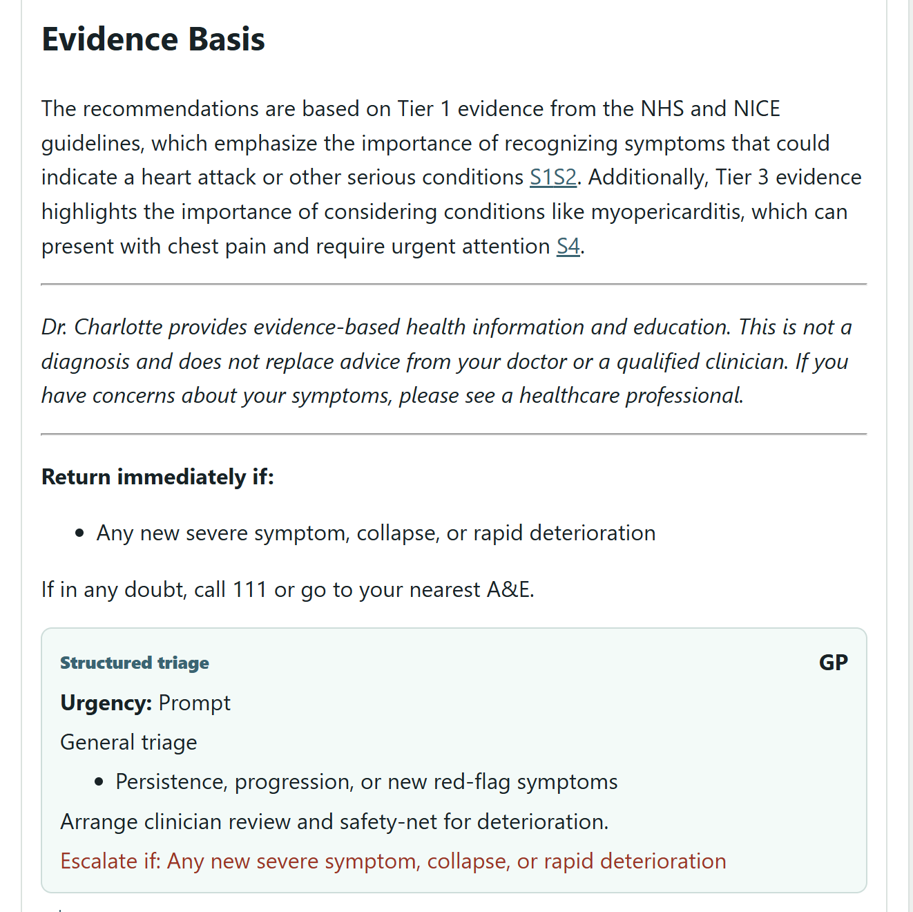
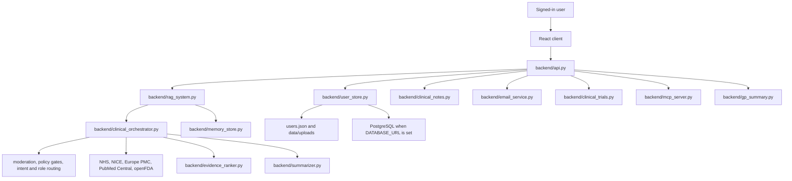

# Dr. Charlotte

Dr. Charlotte is a clinical AI assistant for patients and healthcare professionals. It gives signed-in users a workspace for evidence-based health questions, document upload, symptom and measurement tracking, medication management, SOAP clinical notes, GP-ready summaries, clinical trial search and secure email delivery -- all role-aware, so patients and clinicians see what is appropriate for them.

The Python backend runs the full clinical workflow including retrieval, evidence ranking, role routing, safety policy gates, note generation and email. The React frontend lives in `frontend/` and calls `/api/*` endpoints served by `backend/api.py`. Both are deployed as a single service.

---

## Screenshots

The screenshots below show the app in order of user flow.

### 1. Account Access


### 2. Workspace Home


### 3. Evidence Chat


### 4. Evidence Basis and Triage



### 5. Health Timeline


### 6. Clinical Trial Search


### 7. Ranked Trial Results


### 8. Backend Processing Pipeline


---

## Quick Start

### 1. Python environment

```powershell
py -3.12 -m venv .venv
.\.venv\Scripts\Activate.ps1
py -3.12 -m pip install --upgrade pip
py -3.12 -m pip install -r requirements.txt
```

### 2. Environment variables

Create a `.env` file in the project root:

```env
# OpenAI
OPENAI_API_KEY=your_openai_api_key
OPENAI_BASE_URL=https://api.openai.com/v1
OPENAI_MODEL=gpt-4o-mini
OPENAI_EMBEDDING_MODEL=text-embedding-3-small

# Email (Gmail SMTP)
SMTP_HOST=smtp.gmail.com
SMTP_PORT=587
SMTP_USER=your@gmail.com
SMTP_PASSWORD=your-16-char-app-password
EMAIL_FROM=Dr. Charlotte <your@gmail.com>

# Database (optional -- defaults to local users.json)
DATABASE_URL=

# MCP API key (optional -- protects /mcp endpoint)
MCP_API_KEY=
```

Gmail requires an App Password, not your regular password. Generate one at:
`myaccount.google.com -> Security -> 2-Step Verification -> App passwords`

### 3. Frontend

```powershell
cd frontend
npm install
npm run build
cd ..
```

### 4. Start the server

```powershell
py -m uvicorn backend.api:app --host 127.0.0.1 --port 8000
```

Open `http://127.0.0.1:8000`.

### 5. Frontend development

Keep the backend running on port 8000, then in `frontend/`:

```powershell
npm run dev
```

Vite proxies `/api` to `http://127.0.0.1:8000`.

---

## User Roles

Dr. Charlotte adapts its interface and responses to the signed-in user's role.

| Role | What they see |
|---|---|
| Patient | Clean response text, no clinical metadata, simplified SOAP note view, urgent care strip only when action is needed |
| Doctor | Full SOAP notes (Subjective / Objective / Assessment / Plan), sources, evidence basis, triage card, editable notes |
| Nurse | Role-adapted notes (Presenting concern / Observations / Nursing assessment / Care plan), editable |
| Midwife | Maternal-focused notes (Maternal concern / Maternal and fetal assessment / Risk assessment / Maternity plan), editable |
| Physiotherapist | MSK-focused notes (Presenting complaint / Physical assessment / Clinical impression / Treatment plan), editable |

Patients never see raw clinical metadata, source lists, evidence tiers, trace IDs or SOAP edit controls. Clinicians receive the full clinical picture.

---

## Features

### Account and Access
- Role-aware sign-up with consent gate (GDPR-compliant)
- Role terms shown per clinical role at sign-up
- Password hashed with bcrypt; minimum 8 characters enforced
- Persistent session via JWT stored in localStorage
- Profile editing: display name, email, date of birth, biological sex, care context, organisation

### Evidence Chat
- Streaming evidence-based responses via GPT-4o-mini
- Role-aware clinical workflow: crisis pre-screen, intent classification, risk stratification, tiered evidence retrieval, policy gates and pathway logic applied before every answer
- Follow-up chips after each response: short first-person statements generated from the evidence that the user can tap to refine the answer
- Voice input via OpenAI Whisper (browser microphone permission required)
- Enter to send; Shift+Enter for a new line
- Patient view: clean response text with subtle urgency strip only for high, urgent or crisis levels
- Clinician view: collapsible triage card, source list and evidence basis chips after response text

### Evidence Tiers
Evidence is retrieved and ranked across three tiers:
- Tier 1: NHS guidance and NICE guidelines
- Tier 2: Systematic reviews and Cochrane-style evidence
- Tier 3: Primary research papers from Europe PMC and PubMed Central

### SOAP Clinical Notes
- Generate a SOAP note from the current conversation at any time
- Role-specific section labels and LLM prompt guidance per clinical role
- Backend formats all fields as clean markdown -- no raw Python dicts or lists
- Clinicians can edit all four sections inline and save changes
- Patients see a simplified read-only view: "What was discussed" and "What happens next"
- Notes stored per user and restored on next login
- Email a note directly to the user's registered email address
- Send a GP alert email for notes flagged as requiring a GP visit

### Health Record
- Symptom log with dates, severity, triggers and notes
- Medication list with dose, schedule and openFDA interaction checks
- Allergy and adverse drug reaction list
- Conditions list (active and past)
- Vitals and lab readings: blood pressure, heart rate, weight, blood glucose, oxygen saturation, temperature, HbA1c, eGFR and more
- All record sections editable from the chat side panel

### Document Uploads
- PDF upload with anonymisation and patient-name verification before extraction
- Structured extraction of measurements, allergies, medications, conditions, heights, weights and lab values from uploaded documents
- Extracted data added to the user's retrieval context automatically

### Health Timeline
- Scrollable timeline of conditions, medications, allergies, readings, triage summaries and uploaded records
- Trend cards for chartable vital types when at least two readings are saved

### GP Summary Export
- One-click PDF export of the user's saved health record, documents, longitudinal memory and recent triage summaries ready for a GP or hospital appointment

### Clinical Trial Search
- Searches ClinicalTrials.gov for recruiting trials matched to the user's saved conditions, medications and symptom logs
- Deterministic scoring plus model-based clinical alignment scoring
- Ranked results show trial title, phase, location, contact and link to the official record
- Results saved and restored on next login

### Email Delivery
- SOAP notes emailed as formatted HTML to the user's registered address
- Urgent care alert emails for high, urgent or crisis cases
- Sent via Gmail SMTP (or any SMTP provider) using App Password authentication
- Clear error messages if SMTP is not configured

### Model Context Protocol (MCP) Server
- Mounted at `/mcp` on the same server process -- no separate service needed
- Works in Railway deployments (streamable HTTP) and locally (stdio)
- Optional API key guard via `MCP_API_KEY` environment variable
- Exposes five tools to AI agents and Claude Desktop:
  - `get_patient_context`: full patient profile, conditions, medications, vitals and memory
  - `extract_article_evidence`: structured evidence extraction from a medical article matched to a patient
  - `generate_clinical_note`: generate and save a SOAP note from a consultation summary
  - `send_health_email`: send a clinical note or urgent alert by email
  - `search_trials_for_patient`: search ClinicalTrials.gov for a patient's conditions

### Safety and Moderation
- Crisis pre-screen on every message before the main pipeline
- Eight hard policy gates: crisis, pregnancy, paediatric, medication, diagnosis, elderly, mental health, urgent
- Role-adaptive moderation using Detoxify (RoBERTa) and regex rules
- Escalation triggers and safety-netting included in every clinical answer

---

## Architecture



---

## Project Structure

```text
backend/
  api.py                      FastAPI app, all endpoints and React static file serving
  anonymizer.py               document redaction helpers
  audit_models.py             ClinicalAuditTrace and PolicyGateRecord dataclasses
  clinical_notes.py           SOAP note generation, role-specific prompts and coercion
  clinical_orchestrator.py    main clinical workflow engine
  clinical_trials.py          ClinicalTrials.gov search and scoring
  document_extractor.py       structured extraction from uploaded PDFs
  email_service.py            Gmail SMTP sender for notes and urgent alerts
  evidence_extractor.py       anti-hallucination article evidence extraction
  evidence_ranker.py          three-tier source ranking
  gp_summary.py               GP handover PDF generation
  image_generator.py          image generation integration
  intent_risk_classifier.py   intent and risk level classification
  mcp_server.py               Model Context Protocol server
  medication_checker.py       openFDA interaction checks
  memory_store.py             longitudinal memory refresh
  moderation_ml.py            role-adaptive Detoxify and regex moderation
  official_guidance.py        NHS and MedlinePlus retrieval
  pathways/                   five specialty clinical pathways
    general_triage.py
    maternity.py
    msk.py
    medications.py
    chronic_conditions.py
  policy_engine.py            eight hard safety gates
  pubmed_search.py            Europe PMC and PubMed Central retrieval
  rag_system.py               retrieval, generation and document ingestion engine
  response_templates.py       role-specific headings, personas and tier labels
  role_router.py              RoleConfig and RoleRouter per clinical role
  summarizer.py               LLM wrapper, follow-up chips and SOAP generation helpers
  test_evidence_ranker.py     evidence ranker unit tests
  triage_summary.py           structured triage output
  upload_verification.py      upload name checks and verification helpers
  user_store.py               accounts, profiles, chat history, notes and persistence

frontend/
  index.html                  Vite entry HTML
  package.json                scripts and dependencies
  src/
    App.tsx                   full React app: all views, components and chat logic
    api.ts                    typed API client for all backend endpoints
    styles.css                design system and component styles
    types.ts                  TypeScript types for all shared data shapes
    utils.ts                  formatting and helper functions
  public/                     static assets

agents/
  commands/                   Claude Code skills

Dockerfile                    container build
Procfile                      Railway/Heroku start command
requirements.txt              Python dependencies
```

---

## Tech Stack

| Layer | Technology |
|---|---|
| Frontend | React 18, TypeScript, Vite |
| API | FastAPI, Uvicorn |
| LLM | OpenAI Chat Completions (gpt-4o-mini) |
| Embeddings | OpenAI text-embedding-3-small |
| Voice | OpenAI Whisper |
| Image generation | OpenAI gpt-image-1 |
| Video generation | OpenAI sora-2 |
| Biomedical literature | Europe PMC and PubMed Central |
| Official guidance | NHS Conditions and MedlinePlus |
| Drug interactions | openFDA drug label API |
| Clinical trials | ClinicalTrials.gov API v2 |
| Moderation | Detoxify (RoBERTa) with regex fallback |
| PDF parsing and export | PyMuPDF |
| Email | Gmail SMTP via App Password (or any SMTP provider) |
| MCP | FastMCP streamable HTTP |
| Persistence | Local JSON or PostgreSQL |
| Deployment | Railway, Docker or any ASGI host |

---

## Environment Variables

| Variable | Required | Description |
|---|---|---|
| `OPENAI_API_KEY` | Yes | OpenAI API key |
| `OPENAI_BASE_URL` | Yes | OpenAI base URL |
| `OPENAI_MODEL` | Yes | Chat model name |
| `OPENAI_EMBEDDING_MODEL` | No | Embedding model (default: text-embedding-3-small) |
| `DATABASE_URL` | No | PostgreSQL connection string; uses local JSON if unset |
| `SMTP_HOST` | No | SMTP host (e.g. smtp.gmail.com) |
| `SMTP_PORT` | No | SMTP port (587 for STARTTLS, 465 for SSL) |
| `SMTP_USER` | No | Sender email address |
| `SMTP_PASSWORD` | No | App password for the sender account |
| `EMAIL_FROM` | No | Display name and address, e.g. `Dr. Charlotte <you@gmail.com>` |
| `MCP_API_KEY` | No | Bearer token to restrict access to the /mcp endpoint |

---

## Deployment

### Docker

```bash
docker build -t dr-charlotte .
docker run -p 8000:8000 --env-file .env dr-charlotte
```

### Railway

1. Connect the repository in Railway.
2. Set all environment variables in the Railway Variables panel.
3. Railway reads `Procfile` and starts the server automatically.
4. The MCP server is available at `https://your-app.railway.app/mcp`.

### Claude Desktop (MCP)

Add to `claude_desktop_config.json`:

```json
{
  "mcpServers": {
    "dr-charlotte": {
      "url": "https://your-app.railway.app/mcp",
      "headers": {
        "Authorization": "Bearer YOUR_MCP_API_KEY"
      }
    }
  }
}
```

For local stdio mode:

```json
{
  "mcpServers": {
    "dr-charlotte": {
      "command": "python",
      "args": ["-m", "backend.mcp_server"],
      "cwd": "/path/to/my_health_chatbot"
    }
  }
}
```

---

## PostgreSQL

For hosted or shared deployments, set `DATABASE_URL` so data persists between deployments.

1. Create a PostgreSQL database (Neon, Supabase or any provider).
2. Add `DATABASE_URL` to the environment.
3. Restart the server. The app migrates the schema automatically.

---

## Troubleshooting

**`OPENAI_API_KEY not found`**
Create `.env` with a valid API key and restart the server from the project root.

**Accounts or trial results disappear after a deployment**
Set `DATABASE_URL` so the app uses PostgreSQL. Local `users.json` does not persist across Railway deployments.

**Email button returns an error**
Check that `SMTP_HOST`, `SMTP_USER` and `SMTP_PASSWORD` are set in `.env` and that the server was restarted after editing the file. For Gmail, use an App Password generated at `myaccount.google.com -> Security -> App passwords`, not your regular Gmail password.

**User gets "no email address saved" error**
The email is sent to the address stored in the user's Dr. Charlotte profile. The user must have registered with a valid email or updated their profile email in app settings.

**PDF says the patient name cannot be found**
The upload checker reads the document text and filename. Make sure the full name on the account matches the name in the document. If it differs, the user can choose to continue anyway.

**Extracted data from a PDF looks wrong**
Review the entries in the trackers and remove anything incorrect. The extractor reads free-text documents and may occasionally misread a value, unit or date.

**Clinical trial search returns no results**
The trial finder needs saved health context such as conditions, symptoms or medications. Also confirm the server can make outbound HTTPS requests to `clinicaltrials.gov`.

**Voice input is unavailable**
Allow microphone access in the browser and confirm the backend has a valid OpenAI API key for Whisper transcription.

**MCP tools fail in Claude Desktop**
Confirm `MCP_API_KEY` in your environment matches the key in `claude_desktop_config.json`. For local stdio mode, install the `mcp` package with `pip install mcp` first.

---

## Important Note

Dr. Charlotte is for health education, evidence review and clinical decision support. It is not a substitute for emergency care, a clinical diagnosis or a qualified clinician's judgement.

If someone may be seriously unwell, use the appropriate urgent care route -- NHS 111 or 999 in the UK.
